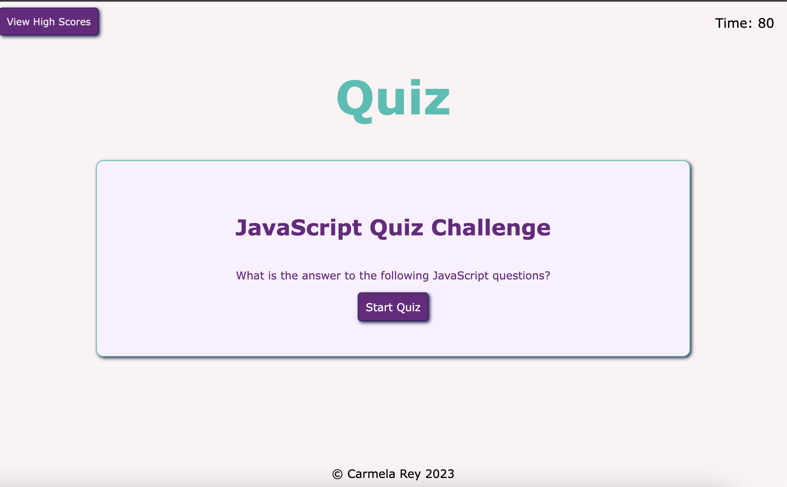
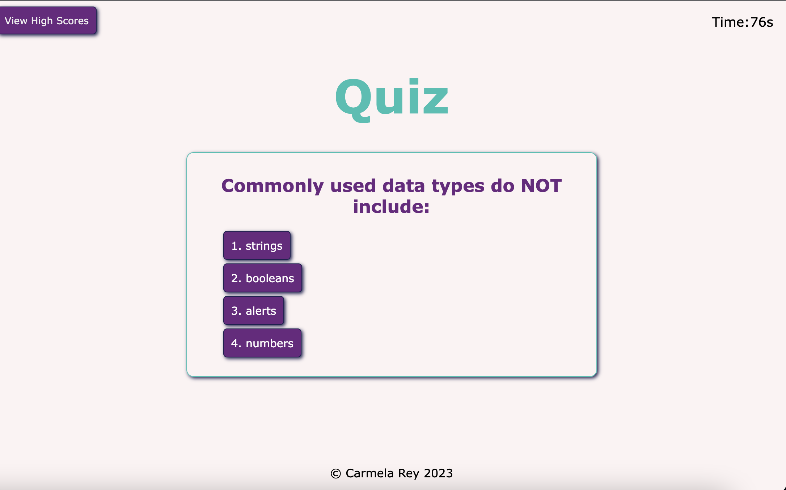
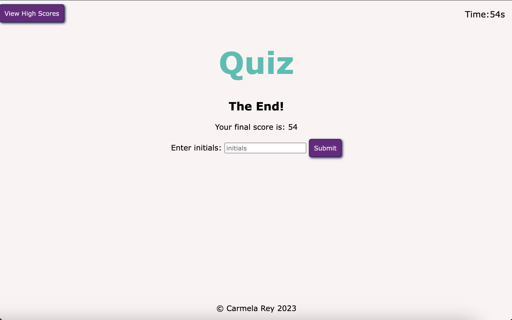

# Quiz App

This is a timed coding quiz with multiple-choice questions relating to JavaScript fundamentals that stores high scores.

## Built with

- HTML
- CSS
- JavaScript
## Acceptance Criteria

```
GIVEN I am taking a code quiz
WHEN I click the start button
THEN a timer starts and I am presented with a question
WHEN I answer a question
THEN I am presented with another question
WHEN I answer a question incorrectly
THEN time is subtracted from the clock
WHEN all questions are answered or the timer reaches 0
THEN the game is over
WHEN the game is over
THEN I can save my initials and my score
```
## Final Result





## Link to Quiz App

[Quiz App JavaScript](https://cdrcar.github.io/Quiz-App/)

## License
[MIT](https://choosealicense.com/licenses/mit/)

## Mentions

Thank you skaliaperumal from AskBCS Learning Assistant for your help!
